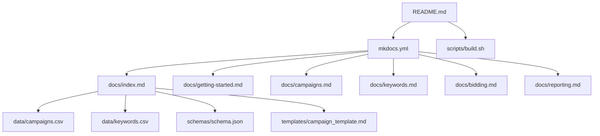

# Amazon-Wiki - Code Dependency Graph

```mermaid
graph TD
    N0["README.md"]
    N1["mkdocs.yml"]
    N2["docs/index.md"]
    N3["docs/getting-started.md"]
    N4["docs/campaigns.md"]
    N5["docs/keywords.md"]
    N6["docs/bidding.md"]
    N7["docs/reporting.md"]
    N8["data/campaigns.csv"]
    N9["data/keywords.csv"]
    N10["schemas/schema.json"]
    N11["templates/campaign_template.md"]
    N12["scripts/build.sh"]
    N0 --> N1
    N1 --> N2
    N1 --> N3
    N1 --> N4
    N1 --> N5
    N1 --> N6
    N1 --> N7
    N2 --> N8
    N2 --> N9
    N2 --> N10
    N2 --> N11
    N0 --> N12
```